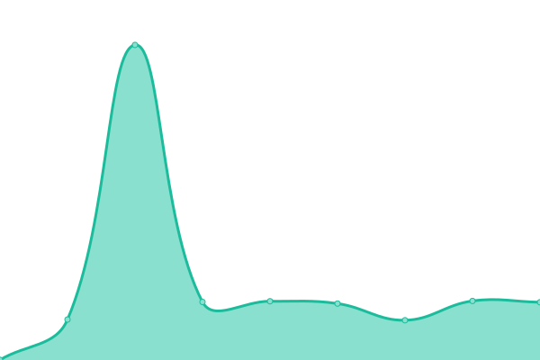
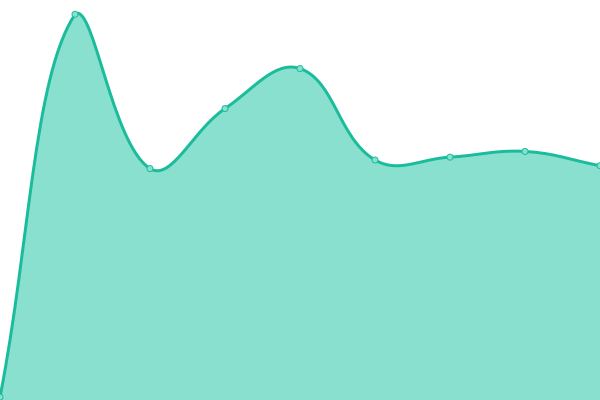
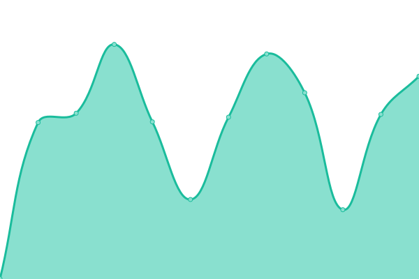

# [📈 Live Status](https://estado.unimonserrate.edu.co): <!--live status--> **🟧 Partial outage**

This repository contains the open-source uptime monitor and status page for [infraestructuraidt](https://estado.unimonserrate.edu.co), powered by [Upptime](https://github.com/upptime/upptime).

With [Upptime](https://upptime.js.org), you can get your own unlimited and free uptime monitor and status page, powered entirely by a GitHub repository. We use [Issues](https://github.com/infraestructuraidt/status/issues) as incident reports, [Actions](https://github.com/infraestructuraidt/status/actions) as uptime monitors, and [Pages](https://estado.unimonserrate.edu.co) for the status page.

<!--start: status pages-->
<!-- This summary is generated by Upptime (https://github.com/upptime/upptime) -->
<!-- Do not edit this manually, your changes will be overwritten -->
<!-- prettier-ignore -->
| URL | Status | History | Response Time | Uptime |
| --- | ------ | ------- | ------------- | ------ |
|  [Sitio WEB Unimonserrate](https://www.unimonserrate.edu.co/) | 🟩 Up | [sitio-web-unimonserrate.yml](https://github.com/infraestructuraidt/status/commits/HEAD/history/sitio-web-unimonserrate.yml) | 

 603ms
     
 | 

<a href="https://estado.unimonserrate.edu.co/history/sitio-web-unimonserrate">99.59%</a>
    

|  [Biblioteca Digital](https://unimonserrate-library.ohelit.co/) | 🟩 Up | [biblioteca-digital.yml](https://github.com/infraestructuraidt/status/commits/HEAD/history/biblioteca-digital.yml) | 

 3551ms
     
 | 

<a href="https://estado.unimonserrate.edu.co/history/biblioteca-digital">100.00%</a>
    

|  [Revistas y publicaciones](http://revistas.unimonserrate.edu.co:8080/index.php) | 🟩 Up | [revistas-y-publicaciones.yml](https://github.com/infraestructuraidt/status/commits/HEAD/history/revistas-y-publicaciones.yml) | 

 805ms
     
 | 

<a href="https://estado.unimonserrate.edu.co/history/revistas-y-publicaciones">99.53%</a>
    

|  [CAU / CAE](http://mesadeayuda.unimonserrate.edu.co:8080/) | 🟩 Up | [cau-cae.yml](https://github.com/infraestructuraidt/status/commits/HEAD/history/cau-cae.yml) | 

 691ms
     
 | 

<a href="https://estado.unimonserrate.edu.co/history/cau-cae">98.87%</a>
    

|  [Praxis](http://virtual.fum.edu.co:9090/Praxis-war/faces/Login.xhtml) | 🟩 Up | [praxis.yml](https://github.com/infraestructuraidt/status/commits/HEAD/history/praxis.yml) | 

 701ms
     
 | 

<a href="https://estado.unimonserrate.edu.co/history/praxis">98.53%</a>
    

|  [Alpha](http://virtual.fum.edu.co:9090/ProgramacionDocente-war/) | 🟩 Up | [alpha.yml](https://github.com/infraestructuraidt/status/commits/HEAD/history/alpha.yml) | 

 142ms
     
 | 

<a href="https://estado.unimonserrate.edu.co/history/alpha">98.53%</a>
    

|  [Paz y salvos](http://virtual.fum.edu.co:8081/#/) | 🟩 Up | [paz-y-salvos.yml](https://github.com/infraestructuraidt/status/commits/HEAD/history/paz-y-salvos.yml) | 

 259ms
     
 | 

<a href="https://estado.unimonserrate.edu.co/history/paz-y-salvos">98.53%</a>
    

|  [Chat Unimonserrate](https://chat.unimonserrate.edu.co/home) | 🟩 Up | [chat-unimonserrate.yml](https://github.com/infraestructuraidt/status/commits/HEAD/history/chat-unimonserrate.yml) | 

 1460ms
     
 | 

<a href="https://estado.unimonserrate.edu.co/history/chat-unimonserrate">96.43%</a>
    

|  [Aulas virtuales](https://aulasvirtuales.unimonserrate.edu.co/) | 🟩 Up | [aulas-virtuales.yml](https://github.com/infraestructuraidt/status/commits/HEAD/history/aulas-virtuales.yml) | 

 1097ms
     
 | 

<a href="https://estado.unimonserrate.edu.co/history/aulas-virtuales">97.59%</a>
    

|  [Uvirtual](https://uvirtual.unimonserrate.edu.co/) | 🟩 Up | [uvirtual.yml](https://github.com/infraestructuraidt/status/commits/HEAD/history/uvirtual.yml) | 

 1152ms
     
 | 

<a href="https://estado.unimonserrate.edu.co/history/uvirtual">98.05%</a>
    

|  Academusoft | 🟥 Down | [academusoft.yml](https://github.com/infraestructuraidt/status/commits/HEAD/history/academusoft.yml) | 

 995ms
     
 | 

<a href="https://estado.unimonserrate.edu.co/history/academusoft">96.94%</a>
    

|  Reportes | 🟩 Up | [reportes.yml](https://github.com/infraestructuraidt/status/commits/HEAD/history/reportes.yml) | 

 1417ms
     
 | 

<a href="https://estado.unimonserrate.edu.co/history/reportes">93.34%</a>
    

|  [Beta](http://virtual.fum.edu.co:9192/SistemaBeta/) | 🟩 Up | [beta.yml](https://github.com/infraestructuraidt/status/commits/HEAD/history/beta.yml) | 

 398ms
     
 | 

<a href="https://estado.unimonserrate.edu.co/history/beta">98.54%</a>
    

<!--end: status pages-->

[**Visit our status website →**](https://estado.unimonserrate.edu.co)

## 📄 License

- Powered by: [Upptime](https://github.com/upptime/upptime)
- Code: [MIT](./LICENSE) © [infraestructuraidt](https://estado.unimonserrate.edu.co)
- Data in the `./history` directory: [Open Database License](https://opendatacommons.org/licenses/odbl/1-0/)
