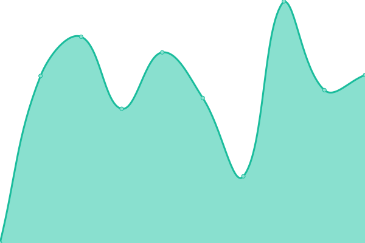

# [📈 Live Status](https://estado.ohelit.co): <!--live status--> **🟩 All systems operational**

Este repositorio contiene el monitor de disponibilidad y la página de estado de [OHELIT](https://ohelit.co), impulsado por [Upptime](https://github.com/upptime/upptime).

Con [Upptime](https://upptime.js.org), puedes obtener tu propio monitor de disponibilidad y página de estado gratuitos, impulsados completamente por un repositorio de GitHub. Usamos [Issues](https://github.com/infraohelit/status/issues) para reportes de incidentes, [Actions](https://github.com/infraohelit/status/actions) para monitorear disponibilidad y [Pages](https://estado.ohelit.co) para la página de estado.

<!--start: status pages-->
<!-- This summary is generated by Upptime (https://github.com/upptime/upptime) -->
<!-- Do not edit this manually, your changes will be overwritten -->
<!-- prettier-ignore -->
| URL | Status | History | Response Time | Uptime |
| --- | ------ | ------- | ------------- | ------ |
|  [UTM - OHELIT](https://remote2.ohelit.co/) | 🟩 Up | [utm-ohelit.yml](https://github.com/infraohelit/status/commits/HEAD/history/utm-ohelit.yml) | 

 310ms
     
 | 

<a href="https://undefined.github.io/undefined/history/utm-ohelit">100.00%</a>
    

<!--end: status pages-->
